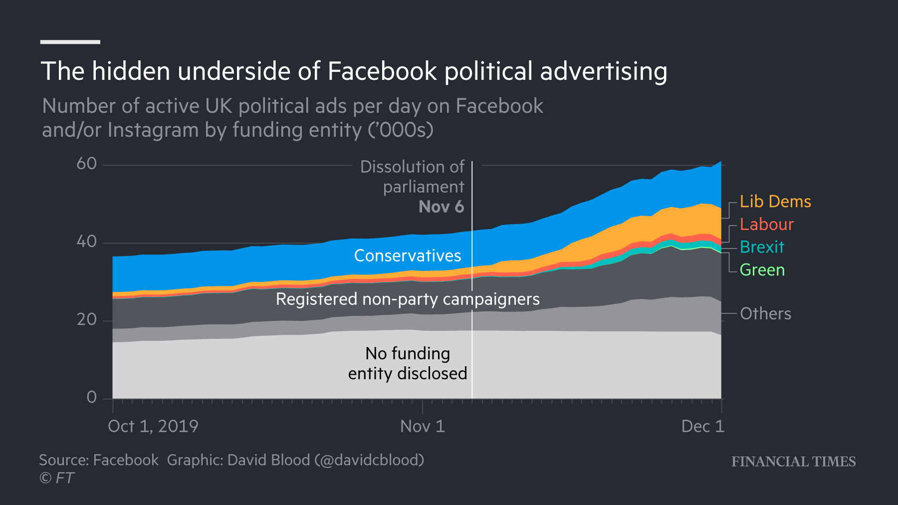

# ge2019-digital-campaigns-notebooks

Jupyter notebooks by [David Blood](https://twitter.com/davidcblood) used in the data reporting for the FT's 2019 UK general election digital campaigns coverage:

- [Voters left in the dark over money behind online election ads](https://www.ft.com/content/f42f9aa2-16ba-11ea-8d73-6303645ac406)
- [Labour and Lib Dems dwarf Tories in online spending battle](https://www.ft.com/content/6a5d2a88-1075-11ea-a7e6-62bf4f9e548a)
- [Tories step up Facebook advertising in last leg of campaign](https://www.ft.com/content/c1358d62-1522-11ea-9ee4-11f260415385)
- [Facebook under fire as political ads vanish from archive](https://www.ft.com/content/e6fb805e-1b78-11ea-97df-cc63de1d73f4)

## Notebooks

### Facebook Ad Library

1. [Facebook Ad Library data wrangling](https://nbviewer.jupyter.org/github/ft-interactive/ge2019-digital-campaigns-notebooks/blob/master/facebook-ad-library/01-wrangle-ad-library-data.ipynb)
2. [Non-party campaigners](https://nbviewer.jupyter.org/github/ft-interactive/ge2019-digital-campaigns-notebooks/blob/master/facebook-ad-library/02-non-party-campaigners.ipynb)
3. Number of active ads per day (TK)

### Google Political Advertising Transparency Report

TK

Sources: [Facebook](https://www.facebook.com/ads/library/api); [Google](https://transparencyreport.google.com/political-ads/home)

